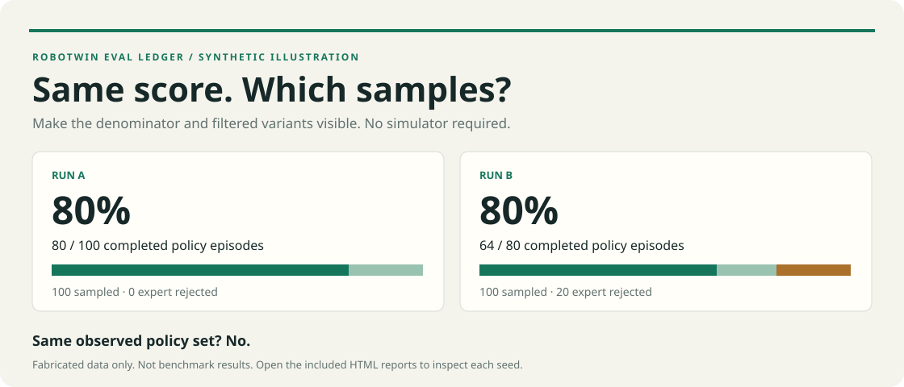

# RoboTwin Eval Ledger

**An 80% success rate does not tell you which seeds were evaluated.**

A small, CPU-only Python package that records evaluation events to one JSONL file per worker, then produces CSV and offline HTML reports. It keeps expert rejection, policy failure, infrastructure interruption, and unfinished work separate. It compares sample sets without pretending that equal seeds prove identical episodes.

Independent, unofficial tooling. No RoboTwin, PyTorch, simulator, GPU, cloud service, or runtime dependency. Python 3.10+.



## Try it in a minute

From this checkout, no installation is necessary:

```sh
python -m robotwin_eval_ledger demo --out demo-output
python -m robotwin_eval_ledger summarize demo-output/run-b --out summary
python -m robotwin_eval_ledger compare demo-output/run-a demo-output/run-b --out comparison
python -m unittest discover -s tests -v
```

Open `demo-output/comparison/report.html` in a browser. The file works offline. A ready-made [HTML comparison](docs/demo/comparison/report.html), [run B report](docs/demo/run-b-report/report.html), and [crash/retry report](docs/demo/recovery-report/report.html) are included. GitHub may show their source; download the ZIP or raw file and open locally.

Optional installation: `python -m pip install .`, then use `robotwin-ledger` instead of `python -m robotwin_eval_ledger`. The package has zero runtime dependencies; installation needs setuptools as the build backend.

### What the synthetic demo proves

| Explicitly fabricated run | Sampled seeds | Expert rejected | Policy success / completed |
|---|---:|---:|---:|
| A | 100 | 0 | 80 / 100 = 80% |
| B | 100 | 20 | 64 / 80 = 80% |

Both report 80%, but the observed policy sets differ. B's rejected variant remains visible. The shared, metadata-matched subset has 80 episodes: A is 80/80 and B is 64/80 **on that selected intersection only**. This is not an overall ranking or benchmark result.

The recovery demo includes a setup error followed by a successful retry, an unfinished policy with a truncated last event, one exact duplicate event, and unknown pairing metadata. No simulation was run to create these examples.

## Record events in an evaluator

```python
from robotwin_eval_ledger import Ledger, fingerprint

# Create one new file per worker. All workers in one run share run_id.
with Ledger("logs/worker-0.jsonl", run_id="experiment-001", worker_id="0",
            config={"policy_checkpoint_hash": "...", "task_config_hash": "..."},
            environment={"evaluator_commit": "...", "asset_manifest_hash": "...",
                         "simulator_version": "...", "robot": "..."}) as log:
    episode = log.start("pick_diverse_bottles", seed=100001, attempt=0)
    # Populate from actual setup, including object slots. Never infer from seed.
    episode.metadata(variant={"left_bottle": 19, "right_bottle": 3})
    episode.expert("accepted")  # rejected ends the attempt; skipped = disabled gate
    # Hash the actual initial policy scene and selected instruction, if available.
    episode.metadata(scene_fingerprint=fingerprint({"actual_initial_state": "..."}),
                     instruction_fingerprint=fingerprint("actual instruction"))
    episode.policy_start()     # flush before calling the policy
    episode.policy(True)       # only after an observed normal rollout result
    # Separately copy the upstream final result and its exact denominator meaning.
    log.official("pick_diverse_bottles", 1, 1, label="upstream completed episodes")
```

The ellipses above are placeholders, not adequate pairing evidence. Leave unavailable fields as `None` rather than hashing placeholders. Log `episode.infra("rollout", "observed transport timeout")` for an interruption and do not also record a policy outcome for that attempt. Classifying a failure cause is the caller's responsibility. Avoid secrets and sensitive details in free-text reasons.

On retry, increment `attempt` for that `(task, seed)` across the whole run. A restarted process uses a new worker ID and a new file; existing files are never appended to by `Ledger`. Do not share one writer between processes or threads. `durable=True` additionally fsyncs each event; the default flushes Python buffers.

See [the executable logging example](examples/record_one_episode.py) and [version-pinned RoboTwin hook locations](docs/robotwin-integration.md). The latter is a manual instrumentation recipe, not a drop-in simulator patch. It has not been simulator-validated.

## Accounting rules

- **Official result:** Only an explicit `official_summary` is shown. Missing official numerator or denominator stays unknown. A coordinator can record it in its own worker file. Once per task/run; conflicting or repeated summaries fail validation.
- **Observed policy rate:** `policy_success / (policy_success + policy_fail)`. Rejected experts, infrastructure errors, and unfinished attempts are excluded and counted visibly. This observed rate is conditional on completed policy outcomes and is not substituted for the official result.
- **Retries:** Both all-attempt and latest-attempt counts are exported. The latest view takes the largest declared attempt number per `(task, seed)`, even if that attempt is unfinished. It never selects the most successful attempt. A late-arriving result does not change the ordering rule.
- **Unknown:** No expert event means unknown, not accepted. No variant means unknown. A started policy without a terminal event is unfinished, not failed. A worker without `worker_end` is flagged. `worker_end` is a lifecycle marker, not proof that all scheduled work finished.
- **Duplicates:** Identical event IDs and canonical payloads are deduplicated and counted. Reusing an ID with different data, a sequence number collision/gap, or two workers claiming one `(task, seed, attempt)` is an error. Events with different IDs are not silently deduplicated.
- **Damage:** Only syntactically invalid, unterminated final lines are ignored, with a warning. Invalid middle lines, newline-terminated invalid final lines, invalid schemas, duplicate JSON keys, and nonfinite numbers are errors. The CLI exits 2 and writes no new report on parsing failure. Existing older report files, if any, remain unchanged.
- **Pairing:** Same `(task, seed)` plus equal, non-null environment fingerprint, variant, initial-scene fingerprint and instruction fingerprint is a `metadata_matched` pair. Missing evidence is `unknown`; a known difference is `mismatch`. Equality is based on caller-declared evidence, not a simulator determinism guarantee. Policy/config fingerprints are displayed for provenance but need not match between policies.

Comparisons use the latest-attempt view and completed policy outcomes only. A set match describes **observed** logged episodes; it cannot certify that unscheduled/unlogged episodes are absent. No significance test or causal conclusion is computed.

## Outputs and event format

`summarize` writes `report.html`, `summary.json`, `summary.csv`, `attempts.csv`, `variants.csv`, and `official.csv`. `compare` writes `report.html`, `comparison.json`, and `comparison.csv`. Reports overwrite those named files in `--out`; raw input JSONL is never modified. Inputs can be one or more files or directories; directory scans are nonrecursive. A summary accepts exactly one `run_id`.

Schema v1 events have `schema`, `event_id`, `run_id`, `worker_id`, `seq`, and `kind`. Attempt events additionally have `task`, integer `seed`, and nonnegative integer `attempt`. Each worker begins with `worker_start` (`config_fingerprint`, nullable `environment_fingerprint`, `synthetic`), uses contiguous sequence numbers starting at 1, and normally ends with `worker_end`.

Attempt kinds: `attempt_start`, `case_metadata`, `expert_result`, `policy_start`, `policy_result`, `infra_error`. Run-level kinds: `worker_start`, `worker_end`, `worker_error`, `official_summary`. The included JSONL demo is a complete format example. The loader validates state transitions; writer calls validate individual event shape and the loader validates the assembled lifecycle. Extra JSON fields are allowed for caller annotations. Fingerprints use SHA-256 over sorted, compact, finite JSON encoded as UTF-8.

CSV represents missing values as `unknown`. Potential spreadsheet-formula text is prefixed with `'`; use JSON for lossless machine consumption. HTML escapes user-supplied text and loads no scripts, fonts, or external assets.

## Scope and limitations

This MVP observes events; it does not run or alter the benchmark, patch object annotations, restart workers, detect a hung process, or infer the cause of a missing event. It does not reconstruct historical missing metadata from stdout. It loads a run into memory, so it is intended for episode-level ledgers rather than per-step telemetry. No simulator, GPU, or real benchmark validation is claimed.

Use a real manifest for environment/config hashes, including relevant task settings, assets, robot setup, renderer/simulator revisions, and instruction-generation settings. Seeds can initialize different scenes across revisions. A hash cannot repair incomplete or incorrect input evidence.

## Public motivation and provenance

Public reports [RoboTwin #482](https://github.com/RoboTwin-Platform/RoboTwin/issues/482) and [#486](https://github.com/RoboTwin-Platform/RoboTwin/issues/486) motivate tracking variant coverage through expert filtering. [#477](https://github.com/RoboTwin-Platform/RoboTwin/issues/477) motivates keeping interrupted infrastructure attempts visible. These reports are motivation, not independently reproduced findings or claims about their current resolution.

The integration recipe was checked against [`eval_policy_xpolicylab.py` at `ea8b211`](https://github.com/RoboTwin-Platform/RoboTwin/blob/ea8b21121ebb3cd201ff5b3fe361944ac94eda3f/scripts/eval_policy_xpolicylab.py). That evaluator prints progress and writes `_result.txt`; the ledger adds structured attempt evidence alongside those outputs. Do not assume the recipe applies unchanged to another revision.

Original implementation, MIT licensed. No upstream code, assets, private project files, model weights, or real evaluation logs are bundled. No affiliation with or endorsement by RoboTwin is implied.

## Validation

The release candidate passes 47 standard-library unit tests on Python 3.12, including CLI output, CSV formula safety, HTML escaping and all accounting cases above. A built wheel was installed into a fresh virtual environment and its CLI exercised outside the checkout. Included HTML files were parsed and checked for external asset/script tags. Browser-rendered visual QA and simulator integration remain unverified. The included GitHub Actions matrix targets Python 3.10, 3.12 and 3.13 when the repository is published.
